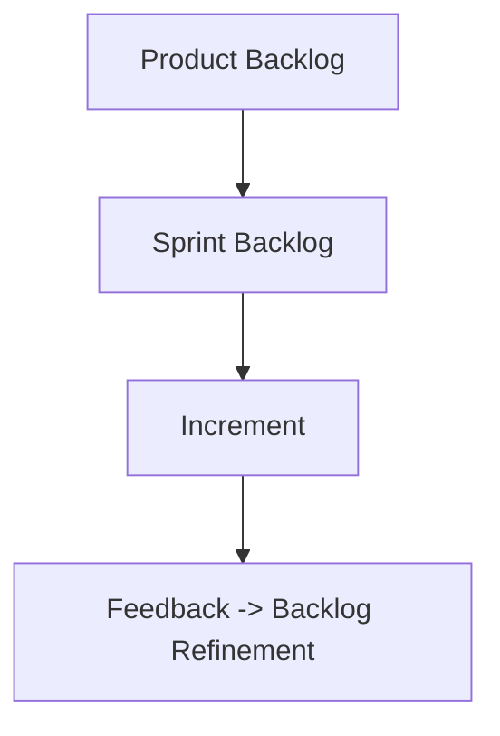

# 🧭 راهنمای جامع اجایل و نقش‌های اسکرام (Agile & Scrum Roles Handbook)

> **تهیه و نگارش:** Samad Elmakchi  
> **نسخه:** 1.0  
> **تاریخ:** نوامبر 2025  
> **توضیح:** این فایل یک مرجع جامع، آموزشی و فنی از مفاهیم، نقش‌ها، ابزارها و روش‌های مدیریت چابک (Agile) و چارچوب اسکرام (Scrum) است. شامل مثال‌های واقعی، نکات عملی، و سوالات مصاحبه برای آماده‌سازی حرفه‌ای شما در دنیای Agile و DevOps.

---

## 🗂️ فهرست مطالب (Table of Contents)

1. [مقدمه: تفکر چابک (Agile Mindset)](#-مقدمه-تفکر-چابک-agile-mindset)
2. [ارزش‌ها و اصول اجایل](#-ارزشها-و-اصول-اجایل)
3. [چارچوب اسکرام (Scrum Framework)](#-چارچوب-اسکرام-scrum-framework)
4. [نقش‌ها در اسکرام](#-نقشها-در-اسکرام)
    - [اسکرام مستر (Scrum Master)](#اسکرام-مستر-scrum-master)
    - [مالک محصول (Product Owner)](#مالک-محصول-product-owner)
    - [تیم توسعه (Development Team)](#تیم-توسعه-development-team)
5. [رویدادهای اسکرام (Scrum Events)](#-رویدادهای-اسکرام-scrum-events)
6. [خروجی‌ها و آرتیفکت‌ها (Artifacts)](#-خروجیها-و-آرتیفکتها-artifacts)
7. [اصطلاحات کلیدی در اسکرام](#-اصطلاحات-کلیدی-در-اسکرام)
8. [فرهنگ اجایل و رفتار تیمی](#-فرهنگ-اجایل-و-رفتار-تیمی)
9. [نقش‌های مکمل: طراح محصول و مدیر پروژه](#-نقشهای-مکمل-طراح-محصول-و-مدیر-پروژه)
10. [فریم‌ورک‌های مرتبط (Kanban, SAFe, DevOps)](#-فریمورکهای-مرتبط-kanban-safe-devops)
11. [ابزارهای تیم‌های چابک](#-ابزارهای-تیمهای-چابک)
12. [سوالات مصاحبه برای نقش‌های چابک](#-سوالات-مصاحبه-برای-نقشهای-چابک)
13. [سناریوهای واقعی از محیط کار](#-سناریوهای-واقعی-از-محیط-کار)
14. [نکات پیشرفته و حرفه‌ای](#-نکات-پیشرفته-و-حرفهای)
15. [منابع و جمع‌بندی نهایی](#-منابع-و-جمعبندی-نهایی)

---

# 🧠 مقدمه: تفکر چابک (Agile Mindset)

در دنیای امروز، پروژه‌های نرم‌افزاری با سرعت بالا، نیاز به انعطاف، یادگیری مستمر و تعامل بین تیم‌ها دارند.  
روش‌های سنتی مانند Waterfall پاسخگوی این تغییرات سریع نیستند.  
از همین‌جا مفهوم **"چابکی" (Agility)** شکل گرفت — رویکردی که به جای کنترل، بر همکاری و پاسخ سریع به تغییر تأکید دارد.

> 💡 **نکته:**  
> چابک بودن یعنی تمرکز بر **ارزش** به‌جای مستندسازی، **یادگیری از تغییر** به‌جای مقاومت در برابر آن، و **اعتماد به تیم‌ها** به‌جای کنترل مداوم.

---

# 💎 ارزش‌ها و اصول اجایل

مانیفست اجایل (Agile Manifesto) در سال ۲۰۰۱ منتشر شد و چهار ارزش بنیادین را معرفی کرد:

| ارزش | توضیح |
|------|--------|
| 👥 افراد و تعاملات | مهم‌تر از فرآیندها و ابزارها هستند |
| 🧩 نرم‌افزار کارا | مهم‌تر از مستندسازی گسترده است |
| 🤝 همکاری با مشتری | مهم‌تر از مذاکره قراردادی است |
| 🔄 پاسخ به تغییر | مهم‌تر از پیروی از یک برنامه ثابت است |

---

## 📜 اصول دوازده‌گانه اجایل (12 Agile Principles)

1. رضایت مشتری از طریق تحویل زودهنگام و مداوم نرم‌افزار مفید  
2. استقبال از تغییر در نیازها حتی در اواخر توسعه  
3. تحویل مکرر نرم‌افزار با ارزش  
4. همکاری روزمره بین افراد کسب‌وکار و توسعه‌دهندگان  
5. ایجاد تیم‌های باانگیزه و اعتماد به آن‌ها  
6. ارتباط چهره‌به‌چهره بهترین روش انتقال اطلاعات است  
7. نرم‌افزار کارا، معیار اصلی پیشرفت است  
8. توسعه پایدار با سرعت ثابت  
9. توجه مداوم به طراحی خوب و کیفیت فنی  
10. سادگی — هنر انجام ندادن کارهای غیرضروری  
11. تیم‌های خودسازمان‌ده، بهترین طراحی‌ها را می‌سازند  
12. بازتاب و بهبود مستمر در بازه‌های زمانی منظم

---

> 💬 **مثال واقعی (سناریو ERP):**  
> در یک پروژه ERP آموزشی، تیم توسعه در میانه مسیر متوجه شد نیاز مشتری از "مدیریت دانشجو" به "مدیریت فرآیند آموزشی" تغییر کرده.  
> در رویکرد اجایل، تیم با کمک اسکرام مستر و مالک محصول، بک‌لاگ را بازبینی و مسیر را اصلاح کرد — بدون نیاز به متوقف کردن پروژه یا بازنویسی کامل.

> ⚠️ **هشدار:**  
> تیم‌هایی که تنها از ابزارها (مثل Jira) استفاده می‌کنند اما تفکر اجایل را ندارند، "چابک‌نما" هستند، نه واقعاً چابک!

---

# ⚙️ چارچوب اسکرام (Scrum Framework)

> **اسکرام** یک چارچوب (Framework) است، نه متدولوژی.  
> این یعنی مجموعه‌ای از اصول و رویدادها که به تیم‌ها کمک می‌کند به‌صورت تکرارشونده و افزایشی محصول بسازند.

---

---

# 👥 نقش‌ها در اسکرام (Scrum Roles)

در چارچوب اسکرام، سه نقش کلیدی تعریف شده است. هرکدام وظایف، مسئولیت‌ها و مهارت‌های متفاوتی دارند، اما هدف نهایی آن‌ها یکی است:  
**تحویل مداوم ارزش (Continuous Delivery of Value)** برای مشتری.

| نقش | هدف اصلی | تمرکز اصلی | تعامل با |
|------|------------|-------------|-------------|
| 🧭 **اسکرام مستر (Scrum Master)** | تسهیل فرآیند اسکرام | افراد و فرهنگ تیم | تیم توسعه و مالک محصول |
| 📦 **مالک محصول (Product Owner)** | حداکثرسازی ارزش محصول | نیازهای مشتری و اولویت‌ها | ذینفعان و تیم توسعه |
| 🧑‍💻 **تیم توسعه (Developers)** | تحویل ارزش فنی | ساخت و ارائه محصول | PO و SM |

---

## 🧭 اسکرام مستر (Scrum Master)

اسکرام مستر نقش **رهبر خدمت‌گزار (Servant Leader)** را دارد.  
او مدیر پروژه نیست، بلکه **تسهیل‌گر** فرآیند است تا تیم بتواند در چارچوب اصول اجایل کار کند.

### 🎯 وظایف کلیدی

| حوزه | وظایف |
|------|--------|
| **برای تیم توسعه** | حذف موانع (Impediments)، ترویج خودسازمان‌دهی، آموزش اصول اسکرام |
| **برای مالک محصول** | کمک در مدیریت بک‌لاگ، تسهیل جلسات، برقراری ارتباط مؤثر با تیم |
| **برای سازمان** | آموزش سایر تیم‌ها، ترویج فرهنگ اجایل، حذف موانع سازمانی |

---

### 🧱 مهارت‌های حیاتی

- مهارت تسهیل‌گری (Facilitation)
- گوش دادن فعال (Active Listening)
- مدیریت تعارض (Conflict Resolution)
- درک عمیق از اصول چابک و ابزارهای آن (Jira, Confluence, Miro, Notion)
- توانایی مربی‌گری تیم (Coaching Skills)

---

> 💬 **سناریوی واقعی (از تجربه ERP آموزشی):**
>
> در یکی از اسپرینت‌های پروژه ERP، تیم توسعه با تأخیر در تحویل ماژول "حضور و غیاب" مواجه شد.  
> اسکرام مستر به‌جای سرزنش، جلسه **Root Cause Analysis** برگزار کرد. مشخص شد علت اصلی، نبود مستندات API بود.  
> در نتیجه، تصمیم گرفت در هر اسپرینت بعدی، **Definition of Done** شامل «مستند کامل API در Swagger» شود.  
> این اقدام باعث شد در اسپرینت‌های بعدی تا ۳۰٪ تأخیرها کاهش یابد.

---

### 📘 اصطلاحات مرتبط با نقش اسکرام مستر

| اصطلاح | معنی |
|---------|-------|
| **Impediment** | مانعی که باعث کندی یا توقف کار تیم می‌شود |
| **Servant Leadership** | رهبری بر پایه خدمت و توانمندسازی دیگران |
| **Facilitation** | هدایت جلسه بدون تحمیل نظر |
| **Retrospective** | جلسه بازتاب برای بهبود فرآیند |
| **Velocity** | میانگین امتیاز Storyهایی که در هر اسپرینت تحویل داده می‌شوند |

---

### 💡 نکته عملی:
> یک اسکرام مستر حرفه‌ای **تیم را پاسخ‌گو نمی‌کند؛ بلکه توانمند می‌کند** تا خودش پاسخ‌گو باشد.  
> هدف او «مدیریت افراد» نیست، بلکه «مدیریت جریان کار» است.

---

### ❓ سوالات مصاحبه برای Scrum Master

| سوال | هدف مصاحبه‌کننده |
|-------|-------------------|
| تفاوت بین اسکرام و کانبان چیست؟ | بررسی درک چارچوب‌ها |
| در صورت عدم حضور Product Owner چه می‌کنی؟ | بررسی توان تصمیم‌گیری در شرایط واقعی |
| چگونه یک Conflict بین دو دولوپر را حل می‌کنی؟ | ارزیابی مهارت‌های نرم (Soft Skills) |
| Velocity چیست و چگونه آن را اندازه می‌گیری؟ | سنجش تجربه در گزارش‌دهی و بهبود |
| اگر تیم در جلسات Daily بی‌انگیزه باشد چه کار می‌کنی؟ | بررسی مهارت انگیزشی و تسهیل‌گری |

---

## 📦 مالک محصول (Product Owner)

مالک محصول مسئول **تعریف، اولویت‌بندی، و حداکثرسازی ارزش محصول** است.  
او رابط بین کسب‌وکار و تیم فنی است و به نوعی "صدای مشتری" محسوب می‌شود.

---

### 🎯 وظایف کلیدی

| حوزه | وظایف |
|------|--------|
| **تعریف محصول** | ایجاد Vision و Roadmap |
| **مدیریت بک‌لاگ** | نوشتن User Storyها، اولویت‌بندی، Refinement |
| **تعامل با ذینفعان** | جمع‌آوری نیازها، هماهنگی اهداف تجاری |
| **ارزیابی خروجی** | تأیید Featureها در Sprint Review و جمع‌آوری Feedback |

---

> 💬 **سناریوی واقعی (پروژه ERP آموزشی):**
>
> در یکی از جلسات بازبینی (Sprint Review)، معلمان خواستار قابلیت جدیدی برای ثبت حضور با QR Code شدند.  
> Product Owner به‌جای افزودن فوری آن به اسپرینت بعد، ابتدا ارزش تجاری و فنی را بررسی کرد.  
> پس از تحلیل ROI، تصمیم گرفت آن را به نسخه ۲.۰ منتقل کند تا در MVP تمرکز تیم از بین نرود.

---

### 📘 مهارت‌های کلیدی

- درک عمیق از بازار و نیاز مشتری  
- توان تحلیل ارزش (Value Analysis)  
- مهارت در ابزارهایی مثل **Jira, Trello, Aha.io**  
- توان نگارش **User Story**, **Epic**, **Acceptance Criteria**

---

### 💡 نکته عملی:
> Product Owner باید بتواند بگوید:  
> «نه، الان نه!» — یعنی به درخواست‌های خارج از استراتژی "نه" بگوید تا تمرکز تیم حفظ شود.

---

### ❓ سوالات مصاحبه برای Product Owner

| سوال | هدف مصاحبه‌کننده |
|-------|-------------------|
| تفاوت Epic، Story و Task چیست؟ | بررسی درک ساختار بک‌لاگ |
| چگونه اولویت‌ها را تعیین می‌کنی؟ | سنجش توان تصمیم‌گیری مبتنی بر ارزش |
| اگر ذینفعی درخواست فوری داشته باشد چه می‌کنی؟ | ارزیابی مهارت مذاکره |
| MVP را چگونه تعریف می‌کنی؟ | سنجش درک از محصول |
| در چه شرایطی Feature را Reject می‌کنی؟ | بررسی توان مدیریت محدوده پروژه |

---

## 🧑‍💻 تیم توسعه (Development Team)

تیم توسعه شامل افرادی است که محصول را می‌سازند — شامل برنامه‌نویسان، طراحان، تسترها، DevOps، تحلیل‌گر داده و غیره.  
تیم باید **چندمهارته (Cross-Functional)** و **خودسازمان‌ده (Self-Organized)** باشد.

---

### 🎯 مسئولیت‌ها

| حوزه | شرح |
|------|------|
| **تحویل خروجی قابل استفاده** | ارائه نرم‌افزار در انتهای هر اسپرینت |
| **پایبندی به Definition of Done** | تحویل کامل، تست‌شده، و مستند |
| **تخمین و تعهد در Sprint Planning** | تعیین ظرفیت واقعی تیم |
| **همکاری مستمر با PO و SM** | شفافیت و ارتباط مؤثر |

---

> 💬 **سناریوی واقعی:**  
> در اسپرینتی که هدف تحویل «سیستم ثبت‌نام» بود، تیم توسعه در روز سوم متوجه شد API خارجی برای پرداخت در دسترس نیست.  
> به‌جای توقف، تصمیم گرفت Mock API طراحی کند تا بخش فرانت‌اند تست شود.  
> این تصمیم نتیجه‌ی **خودسازمان‌دهی (Self-Organization)** تیم بود.

---

### 📘 ابزارهای رایج تیم توسعه

| حوزه | ابزار |
|-------|--------|
| مدیریت کار | Jira, Trello, Notion |
| مستندسازی | Confluence, GitBook |
| طراحی فنی | Draw.io, Lucidchart |
| تست و CI/CD | GitLab CI, Jenkins, GitHub Actions |

---

### ❓ سوالات مصاحبه برای تیم توسعه در محیط اسکرام

| سوال | هدف مصاحبه‌کننده |
|-------|-------------------|
| تفاوت Sprint Goal و Backlog Item چیست؟ | سنجش درک ساختاری |
| Definition of Done چیست؟ | بررسی تعهد به کیفیت |
| اگر در میانه اسپرینت متوجه خطای طراحی شوی چه می‌کنی؟ | سنجش فرهنگ بازخورد |
| Velocity چگونه محاسبه می‌شود؟ | سنجش تجربه با متریک‌ها |

---

> ⚙️ **خلاصه کلیدی نقش‌ها:**

| نقش | تمرکز اصلی | هدف |
|------|-------------|------|
| اسکرام مستر | فرآیند و تیم | بهبود جریان کار |
| مالک محصول | ارزش و مشتری | حداکثرسازی ارزش |
| تیم توسعه | تحویل فنی | تولید خروجی قابل استفاده |

---

---

# 📆 رویدادهای اسکرام (Scrum Events)

چارچوب اسکرام از پنج رویداد رسمی تشکیل شده است.  
هدف از این رویدادها ایجاد **ریتم منظم**، **شفافیت** و **بازخورد مداوم** در طول توسعه محصول است.

| رویداد | هدف | شرکت‌کنندگان اصلی | زمان‌بندی |
|----------|------|----------------------|-------------|
| 🗓️ Sprint | چرخه اصلی تحویل ارزش | همه اعضای تیم | 1 تا 4 هفته |
| 🎯 Sprint Planning | برنامه‌ریزی اهداف اسپرینت | PO, SM, Dev Team | ابتدای هر Sprint |
| 📢 Daily Scrum | هماهنگی روزانه تیم | Dev Team (با حضور SM) | روزانه، 15 دقیقه |
| 🧩 Sprint Review | ارائه خروجی و جمع‌آوری بازخورد | همه تیم + ذینفعان | انتهای Sprint |
| 🔍 Retrospective | بررسی و بهبود فرآیند تیمی | Scrum Team | بعد از Review |

---

## 🗓️ ۱. اسپرینت (Sprint)

اسپرینت قلب تپنده‌ی اسکرام است.  
هر اسپرینت یک **بازه زمانی ثابت** است که در آن تیم، بخشی از محصول را با کیفیت قابل ارائه (Potentially Shippable) تحویل می‌دهد.

### 🎯 هدف اصلی:
تحویل بخشی از محصول که واقعاً برای کاربر ارزش دارد.

---

### ⚙️ ویژگی‌های اسپرینت

| ویژگی | توضیح |
|--------|-------|
| زمان ثابت | معمولاً بین 1 تا 4 هفته |
| محدوده مشخص | هیچ آیتمی در طول اسپرینت بدون هماهنگی تغییر نمی‌کند |
| خروجی مشخص | حداقل یک قابلیت قابل‌استفاده (Increment) |
| بازخورد سریع | در پایان هر اسپرینت، بازبینی و بهبود انجام می‌شود |

---

> 💬 **سناریوی واقعی (پروژه ERP آموزشی):**
>
> تیم توسعه تصمیم گرفت در اسپرینت دوم، قابلیت «ثبت نمرات دانشجو» را بسازد.  
> هدف اسپرینت به‌صورت زیر تعریف شد:
> > 🎯 *“امکان ثبت و ویرایش نمرات توسط اساتید در پنل آموزشی.”*  
>
> در پایان اسپرینت، نسخه MVP این قابلیت آماده شد و در جلسه Review به مدیران آموزش ارائه شد.

---

## 🎯 ۲. برنامه‌ریزی اسپرینت (Sprint Planning)

اولین رویداد هر اسپرینت است. در این جلسه، تیم تصمیم می‌گیرد **چه کاری** انجام دهد و **چگونه** آن را انجام دهد.

### 📋 ورودی‌ها:
- Product Backlog (از PO)
- ظرفیت تیم (Team Capacity)
- اهداف محصول و ارزش مورد انتظار

---

### 📘 خروجی‌ها:
| خروجی | توضیح |
|---------|--------|
| **Sprint Goal** | هدف اصلی اسپرینت |
| **Sprint Backlog** | فهرست آیتم‌های منتخب از بک‌لاگ |
| **طرح اولیه اجرا (Plan)** | تصمیم درباره‌ی نحوه انجام کارها |

---

> 💬 **سناریوی واقعی:**  
> در جلسه برنامه‌ریزی، تیم با PO بررسی کرد که کدام User Story بیشترین ارزش را دارد.  
> نتیجه این بود که از بین ۸ آیتم، تنها ۵ مورد در ظرفیت اسپرینت جای می‌گیرند.  
> در نتیجه، هدف اسپرینت به‌صورت مشترک تعیین شد و Storyهای باقی‌مانده برای Sprint بعدی نگه‌داشته شدند.

---

> 💡 **نکته عملی:**  
> اگر در جلسه Planning بیش از ۴ ساعت (برای اسپرینت دو هفته‌ای) صرف می‌شود، نشانه آن است که بک‌لاگ PO به‌اندازه کافی آماده (Refined) نیست.

---

## 📢 ۳. اسکرام روزانه (Daily Scrum)

جلسه‌ای کوتاه (حداکثر ۱۵ دقیقه) برای هماهنگی روزانه تیم توسعه است.  
هدف اصلی این جلسه، **هماهنگی، شفافیت، و شناسایی موانع (Impediments)** است — نه گزارش‌دهی به مدیر.

---

### 🔹 قالب سنتی Daily:
هر عضو تیم سه سؤال را پاسخ می‌دهد:
1. دیروز چه کاری انجام دادم؟
2. امروز روی چه چیزی کار می‌کنم؟
3. چه موانعی در مسیرم وجود دارد؟

---

> 💬 **سناریوی واقعی:**  
> در پروژه ERP، یکی از دولوپرها در Daily اعلام کرد:  
> «من روی API نمرات کار می‌کنم ولی سرور تست در دسترس نیست.»  
> اسکرام مستر همان روز با تیم DevOps هماهنگ کرد تا مشکل دسترسی رفع شود — پیش از اینکه تبدیل به مانع بزرگ‌تری شود.

---

### 💡 نکات عملی:
- جلسه باید در زمان ثابت (مثلاً هر روز ساعت ۱۰ صبح) برگزار شود.  
- بهتر است در کنار برد فیزیکی یا ابزار Jira Board انجام شود.  
- هیچ‌کس نباید جلسه را به گزارش مدیریتی تبدیل کند.

---

## 🧩 ۴. بازبینی اسپرینت (Sprint Review)

در پایان هر اسپرینت، تیم خروجی خود را به ذینفعان ارائه می‌دهد.  
هدف جلسه، **جمع‌آوری بازخورد واقعی** و **تصمیم‌گیری درباره مسیر بعدی محصول** است.

---

### 🎯 شرکت‌کنندگان:
- تیم اسکرام (SM, PO, Dev Team)
- ذینفعان (Stakeholders)
- گاهی کاربران نهایی

---

> 💬 **سناریوی واقعی:**  
> پس از تحویل ماژول "ثبت نمرات"، مدیر آموزش در جلسه Review پیشنهاد کرد بخش گزارش تحلیلی نمرات هم اضافه شود.  
> PO تصمیم گرفت این نیاز را به‌عنوان **Epic جدید** در Product Backlog اضافه کند تا در نسخه بعد بررسی شود.

---

### 💡 نکات کلیدی:
- تمرکز بر نمایش **Featureهای آماده** است، نه دموهای ناقص.  
- هدف، **بازخورد** است نه **تقدیر**.  
- PO باید بک‌لاگ را پس از جلسه بازبینی به‌روزرسانی کند.

---

## 🔍 ۵. بازاندیشی اسپرینت (Sprint Retrospective)

آخرین جلسه هر اسپرینت برای بهبود عملکرد تیمی است.  
در این جلسه، اعضا صادقانه درباره‌ی **آنچه خوب بود، آنچه بد بود، و آنچه باید تغییر کند** صحبت می‌کنند.

---

### 🎯 هدف:
- بهبود فرآیندهای تیمی  
- افزایش کارایی و رضایت اعضا  
- تشویق به یادگیری مداوم

---

### 📘 خروجی‌ها:
| مورد | توضیح |
|------|--------|
| لیست اقدام‌های بهبود (Action Items) | تغییراتی که باید در اسپرینت بعد اعمال شوند |
| بینش‌های یادگیری | تجربیاتی که باعث رشد تیم می‌شود |

---

> 💬 **سناریوی واقعی:**  
> در جلسه بازاندیشی، تیم متوجه شد که وظایف QA همیشه در روزهای آخر انجام می‌شود و باعث فشار زیاد می‌شود.  
> تصمیم گرفتند از اسپرینت بعد، **تست تدریجی (Continuous Testing)** را اجرا کنند.  
> این تصمیم در دو اسپرینت بعد باعث کاهش ۲۰٪ باگ‌ها شد.

---

### 💡 نکات عملی:
> 🔸 تمرکز Retrospective بر **بهبود فرآیندها** است، نه **سرزنش افراد**.  
> 🔸 Scrum Master باید محیطی امن ایجاد کند تا همه بدون ترس حرف بزنند.  
> 🔸 توصیه می‌شود از تکنیک‌های تسهیل مثل “Start, Stop, Continue” یا “Mad, Sad, Glad” استفاده شود.

---

# 🧾 خلاصه بصری رویدادها

| رویداد | هدف | خروجی | بازه زمانی |
|----------|------|----------|-------------|
| Sprint | اجرای چرخه تولید ارزش | Increment | 1–4 هفته |
| Sprint Planning | برنامه‌ریزی اسپرینت | Sprint Goal, Backlog | ابتدای Sprint |
| Daily Scrum | هماهنگی روزانه | رفع موانع | روزانه |
| Sprint Review | دریافت بازخورد از ذینفعان | Feedback, Updated Backlog | پایان Sprint |
| Retrospective | بهبود فرآیند تیمی | Action Plan | بعد از Review |

---

> 💬 **نکته کلیدی:**
> قدرت اسکرام در تکرار همین چرخه‌هاست — هر اسپرینت فرصتی است برای تحویل ارزش، یادگیری، و بهبود.

---

---

# 📦 آرتیفکت‌ها و خروجی‌های اسکرام (Scrum Artifacts)

آرتیفکت‌ها در اسکرام سه بخش اصلی دارند و هرکدام برای **ایجاد شفافیت، تمرکز و بازخورد** طراحی شده‌اند:

| آرتیفکت | هدف | مسئول اصلی | خروجی ملموس |
|----------|------|---------------|----------------|
| 🧾 Product Backlog | فهرست نیازهای کل محصول | Product Owner | User Stories, Epics |
| 📋 Sprint Backlog | فهرست کارهای منتخب برای اسپرینت جاری | تیم توسعه | Sprint Tasks |
| 🧱 Increment | نتیجه نهایی قابل تحویل هر اسپرینت | تیم توسعه | نسخه آماده (Shippable Product) |

---

## 🧾 Product Backlog (بک‌لاگ محصول)

بک‌لاگ محصول فهرستی پویا از تمام نیازهای محصول است — هرچیزی که باید ساخته شود در اینجا ثبت می‌شود.  
در واقع، **Product Backlog قلب ارتباط بین کسب‌وکار و تیم توسعه است.**

---

### 📋 ویژگی‌های بک‌لاگ

| ویژگی | توضیح |
|--------|--------|
| **پویا (Dynamic)** | با تغییر نیاز بازار یا بازخوردها، دائم به‌روزرسانی می‌شود |
| **اولویت‌دار (Prioritized)** | بر اساس ارزش تجاری و ریسک مرتب می‌شود |
| **تدریجی (Emergent)** | به‌مرور کامل‌تر و دقیق‌تر می‌شود |
| **شفاف (Transparent)** | همه اعضا به آن دسترسی دارند |

---

### 🧩 ساختار آیتم‌های بک‌لاگ

هر آیتم معمولاً با فرمت **User Story** نوشته می‌شود:

> **User Story Template:**
> ```
> به عنوان یک [نقش کاربر]  
> می‌خواهم [عملکرد خاصی انجام دهم]  
> تا بتوانم [به هدفی برسم]
> ```

---

> 💬 **مثال واقعی (از ERP آموزشی):**
> ```
> به عنوان یک استاد  
> می‌خواهم بتوانم نمرات دانشجویان را در پنل ثبت و ویرایش کنم  
> تا بتوانم فرآیند ارزیابی را سریع‌تر انجام دهم
> ```

---

### 📘 اجزای User Story

| جزء | توضیح |
|------|--------|
| **Title** | نام کوتاه قابلیت |
| **Description** | توضیح نیاز کاربر |
| **Acceptance Criteria** | معیار پذیرش — یعنی چه زمانی Story کامل است |
| **Story Points** | میزان تلاش مورد نیاز |
| **Priority / Value** | اهمیت تجاری و فنی |

---

### 💡 نکته عملی:
> بک‌لاگ هرگز "کامل" نیست — بلکه "زنده" است.  
> PO باید به‌صورت منظم جلسه **Backlog Refinement** برگزار کند تا آیتم‌ها آماده ورود به اسپرینت باشند.

---

### ❓ سوالات مصاحبه‌ای:

| سوال | هدف |
|------|------|
| تفاوت Epic و Story چیست؟ | سنجش درک ساختار بک‌لاگ |
| چه کسی بک‌لاگ را اولویت‌بندی می‌کند؟ | بررسی نقش PO |
| چگونه یک Story را قابل تخمین می‌کنی؟ | سنجش تجربه در Grooming |
| چه زمانی آیتمی آماده ورود به Sprint است؟ | شناخت مفهوم DoR |

---

## 📋 Sprint Backlog (بک‌لاگ اسپرینت)

فهرستی از آیتم‌هایی که تیم برای **اسپرینت جاری** انتخاب کرده است.  
این سند نشان می‌دهد تیم دقیقاً روی چه کارهایی در حال فعالیت است.

---

### 🎯 اهداف Sprint Backlog

- تمرکز بر کارهای با ارزش بالا  
- شفافیت برای تیم و ذینفعان  
- پیگیری پیشرفت با برد یا ابزار Jira

---

### 📘 اجزای بک‌لاگ اسپرینت

| جزء | توضیح |
|------|--------|
| **Sprint Goal** | هدف کلیدی اسپرینت |
| **Selected Stories** | آیتم‌های انتخاب‌شده از Product Backlog |
| **Tasks** | وظایف خردشده برای اجرای Storyها |
| **Progress Tracking** | وضعیت هر Task (To Do / In Progress / Done) |

---

> 💬 **سناریوی واقعی:**
>
> در اسپرینت سوم پروژه ERP، تیم هدف زیر را تعیین کرد:  
> 🎯 *“ایجاد سیستم ثبت حضور و غیاب دانشجویان با کارت QR.”*  
>
> از بین ۱۵ آیتم در Product Backlog، فقط ۶ مورد انتخاب شد و در Jira Board به ستون‌های مختلف تقسیم گردید:
> - To Do → طراحی دیتابیس  
> - In Progress → API اسکن QR  
> - Done → رابط کاربری پنل استاد

---

### 💡 نکات عملی:
- Sprint Backlog نباید در طول اسپرینت بیش از حد تغییر کند.  
- اما اگر لازم شد، تیم می‌تواند با هماهنگی PO، آیتم جدید اضافه یا حذف کند.

---

## 🧱 Increment (افزوده محصول)

خروجی نهایی هر اسپرینت است؛ چیزی که باید **قابل استفاده و تست‌شده باشد**.  
در پایان هر اسپرینت، باید حداقل یک **قابلیت آماده تحویل (Shippable Feature)** وجود داشته باشد.

---

### 📋 ویژگی‌های Increment

| ویژگی | توضیح |
|--------|--------|
| **قابل ارائه (Usable)** | کاربر نهایی بتواند از آن استفاده کند |
| **تست‌شده (Tested)** | همه تست‌های QA، Unit و Integration انجام شده‌اند |
| **مستند (Documented)** | در ابزارهایی مثل Confluence یا Swagger ثبت شده است |
| **منطبق با Definition of Done** | مطابق با معیارهای کیفیت تیم |

---

> 💬 **مثال:**  
> اگر در پایان اسپرینت فقط ۹۰٪ کد نوشته شده ولی تست‌ها کامل نیستند، آن آیتم هنوز **Increment محسوب نمی‌شود**.

---

## ✅ Definition of Done (تعریف انجام‌شده)

**DoD** توافق تیمی درباره‌ی این است که چه زمانی یک آیتم "واقعاً تمام شده" است.  
این سند معیار کیفیت و تحویل است.

---

### 📘 مثال از Definition of Done در پروژه ERP

| معیار | وضعیت |
|--------|--------|
| کد در Git Commit شده و Pull Request Merge شده | ✅ |
| تست‌های واحد و یکپارچه پاس شده‌اند | ✅ |
| مستندات API در Swagger به‌روز است | ✅ |
| Deployment در محیط Staging انجام شده | ✅ |
| تأیید Product Owner دریافت شده | ✅ |

---

> 💡 **نکته:**  
> Definition of Done باید **مشترک بین کل تیم** باشد — نه فقط بین Devها.  
> در غیر این صورت، منجر به برداشت‌های متفاوت از "تمام شدن" می‌شود.

---

## 📋 Definition of Ready (تعریف آمادگی)

**DoR** نشان می‌دهد یک آیتم آماده ورود به اسپرینت است.  
یعنی تیم توسعه قبل از شروع، تمام اطلاعات و شرایط لازم را دارد.

---

### 📘 مثال از Definition of Ready

| معیار | توضیح |
|--------|--------|
| توضیح Story کامل و واضح است | ✅ |
| معیار پذیرش (Acceptance Criteria) مشخص شده | ✅ |
| UX/UI نهایی تأیید شده | ✅ |
| Story Points تخمین زده شده | ✅ |
| وابستگی‌ها (Dependencies) بررسی شده | ✅ |

---

> 💬 **سناریو:**  
> تیم توسعه Story‌ای را بدون UI نهایی انتخاب کرد، اما در میانه اسپرینت طراح در دسترس نبود.  
> نتیجه؟ تأخیر!  
> از اسپرینت بعد، تیم تصمیم گرفت هیچ Story بدون **DoR کامل** را انتخاب نکند.

---

## 🧭 ارتباط بین آرتیفکت‌ها


💬 چرخه بالا نشان می‌دهد اسکرام یک حلقه‌ی بسته است —
هر Increment بازخوردی تولید می‌کند که به Product Backlog برمی‌گردد.

## 🔍 خلاصه کلیدی
| مفهوم           | توضیح کوتاه                         | مسئول اصلی    |
| --------------- | ----------------------------------- | ------------- |
| Product Backlog | فهرست نیازهای کل محصول              | Product Owner |
| Sprint Backlog  | کارهای انتخاب‌شده برای اسپرینت جاری | تیم توسعه     |
| Increment       | خروجی قابل تحویل اسپرینت            | تیم توسعه     |
| DoD             | معیار تکمیل کار                     | کل تیم        |
| DoR             | معیار آمادگی آیتم                   | PO + Dev Team |

--

---

# 📘 فصل ۵: اصطلاحات کلیدی اسکرام (Scrum Key Terms)

این فصل شامل مفاهیم فنی و عملیاتی‌ای است که هر اسکرام‌مستر، تیم توسعه، یا Product Owner باید به آن مسلط باشد.  
یادگیری دقیق آن‌ها باعث می‌شود هم در مدیریت پروژه و هم در مصاحبه‌های شغلی عملکرد درخشانی داشته باشی.

---

## 🧭 فهرست مفاهیم

| # | مفهوم | توضیح کوتاه |
|---|--------|---------------|
| 1️⃣ | Sprint Goal | هدف اصلی هر اسپرینت |
| 2️⃣ | Velocity | سرعت انجام کار تیم در هر اسپرینت |
| 3️⃣ | Burndown Chart | نمودار پیگیری پیشرفت |
| 4️⃣ | Epic | ویژگی بزرگ قابل تقسیم به Storyها |
| 5️⃣ | Story | نیاز یا قابلیت کوچک‌تر |
| 6️⃣ | Task | کار خرد برای انجام Story |
| 7️⃣ | Spike | تحقیق فنی یا تست اولیه برای رفع ابهام |
| 8️⃣ | Story Point | واحد تخمین پیچیدگی |
| 9️⃣ | Capacity | ظرفیت کاری تیم در اسپرینت |
| 🔟 | Impediment | مانع پیشرفت تیم |

---

## 🎯 1️⃣ Sprint Goal (هدف اسپرینت)

> **تعریف:**  
> هدف کلی و قابل سنجش برای هر اسپرینت که تیم بر اساس آن تصمیم می‌گیرد چه آیتم‌هایی را انتخاب کند.

---

### 📘 ویژگی‌ها

| ویژگی | توضیح |
|--------|--------|
| **واضح و قابل اندازه‌گیری** | باید بتوان در انتهای اسپرینت گفت "انجام شد یا نه" |
| **الهام‌بخش** | به تیم انگیزه و جهت می‌دهد |
| **مرتبط با ارزش محصول** | هر Sprint Goal باید در راستای ارزش کلی محصول باشد |

---

> 💬 **مثال از ERP آموزشی:**  
> 🎯 *هدف اسپرینت پنجم:*  
> «ایجاد قابلیت ثبت نمرات در پنل استاد و نمایش آن در داشبورد دانشجو.»

---

### 💡 نکته:
> اگر اسپرینت بدون هدف مشخص شروع شود، در واقع تیم فقط «مشغول کار» است، نه «در حال پیشرفت».

---

## 🧮 2️⃣ Velocity (سرعت تیم)

> **تعریف:**  
> مقدار کاری که تیم در یک اسپرینت انجام داده است، بر حسب **Story Point**.

---

### 📘 کاربردها

| کاربرد | توضیح |
|---------|--------|
| پیش‌بینی آینده | تخمین تعداد Storyهایی که تیم می‌تواند در اسپرینت بعدی انجام دهد |
| سنجش پایداری تیم | بررسی یکنواختی عملکرد در طول زمان |
| برنامه‌ریزی ظرفیت | تنظیم بار کاری تیم با توان واقعی |

---

> 💬 **مثال:**  
> اگر تیم در سه اسپرینت گذشته 34، 36، و 35 پوینت انجام داده باشد، Velocity میانگین = 35 SP است.  
> بنابراین برای اسپرینت بعد نیز حدود 35 SP برنامه‌ریزی می‌شود.

---

### ⚠️ هشدار:
> Velocity شاخص عملکرد فردی نیست ❌  
> بلکه معیاری تیمی است که برای پیش‌بینی استفاده می‌شود، نه قضاوت.

---

## 📈 3️⃣ Burndown Chart (نمودار سوختن کارها)

> **تعریف:**  
> نموداری است که میزان کار باقیمانده را در طول زمان اسپرینت نمایش می‌دهد.

---

### 📘 اجزای نمودار

| محور | توضیح |
|-------|--------|
| محور X | روزهای اسپرینت |
| محور Y | تعداد Story Points یا Tasks باقی‌مانده |

---

### 📊 تفسیر نمودار

- خط ایده‌آل (Ideal Line): نشان‌دهنده مسیر مطلوب کاهش کار است  
- خط واقعی (Actual Line): وضعیت واقعی کارها را نشان می‌دهد  

اگر خط واقعی بالاتر از ایده‌آل باشد → **تأخیر وجود دارد**  
اگر پایین‌تر باشد → **تیم جلوتر از برنامه است**

---

> 💬 **مثال از Jira:**  
> در اسپرینت ۲، تیم باید ۴۰ SP را تکمیل کند.  
> در روز چهارم فقط ۵ SP سوخته → هشدار قرمز در Burndown Chart ظاهر می‌شود.

---

## 🧩 4️⃣ Epic (اپیک)

> **تعریف:**  
> یک قابلیت بزرگ که قابل تقسیم به چندین **User Story** است.

---

### 📘 مثال از ERP:

> 🎓 **Epic:** سیستم مدیریت نمرات  
> شامل:  
> - Story 1: ثبت نمره  
> - Story 2: مشاهده نمره توسط دانشجو  
> - Story 3: محاسبه معدل  

---

### 💡 نکته:
> Epicها معمولاً در سطح **Roadmap یا Release Planning** استفاده می‌شوند، نه در اسپرینت.

---

## 🧾 5️⃣ Story (استوری)

> **تعریف:**  
> یک نیاز کاربر یا قابلیت جزئی از محصول.

---

### 📘 فرمت استاندارد
```
به عنوان یک [نقش کاربر]
می‌خواهم [عملکرد خاص]
تا بتوانم [هدف نهایی]
```

---

### 📋 معیارهای Story خوب (INVEST)

| حرف | مفهوم | توضیح |
|------|--------|--------|
| I | Independent | مستقل از سایر Storyها |
| N | Negotiable | قابل بحث و بهبود |
| V | Valuable | دارای ارزش واقعی برای کاربر |
| E | Estimable | قابل تخمین |
| S | Small | اندازه مناسب برای یک اسپرینت |
| T | Testable | قابل تست |

---

## ⚙️ 6️⃣ Task (تسک)

> **تعریف:**  
> جزئی‌ترین سطح کار در اسکرام که برای اجرای یک Story انجام می‌شود.

---

### 📘 مثال:
> Story: «ثبت نمرات استاد»  
> Tasks:
> - طراحی دیتابیس نمرات  
> - ساخت API ثبت نمره  
> - طراحی فرم UI  
> - نوشتن تست واحد  

---

### 💡 نکته:
> تسک‌ها معمولاً بین اعضای تیم تقسیم می‌شوند و در برد Jira به‌صورت **To Do / In Progress / Done** نمایش داده می‌شوند.

---

## 🔍 7️⃣ Spike (اسپایک)

> **تعریف:**  
> تحقیقی کوتاه و زمان‌دار برای بررسی یک فناوری یا رفع ابهام فنی.

---

### 📘 مثال:
> تیم نمی‌داند بهتر است از **GraphQL** استفاده کند یا **REST API**.  
> بنابراین یک Spike دو روزه تعریف می‌کند تا نتایج مقایسه را مستند کند.

---

> 💡 هدف Spike تولید کد نهایی نیست، بلکه تولید **دانش** است.

---

## ⚖️ 8️⃣ Story Point (امتیاز داستان)

> **تعریف:**  
> واحد تخمینی برای سنجش پیچیدگی نسبی یک Story — نه مدت زمان واقعی.

---

### 📘 شاخص‌های موثر بر Story Point

| شاخص | توضیح |
|--------|--------|
| میزان تلاش (Effort) | چقدر باید کدنویسی و تست انجام شود |
| پیچیدگی فنی (Complexity) | چند بخش از سیستم درگیر می‌شوند |
| عدم قطعیت (Uncertainty) | چقدر تجربه مشابه قبلی وجود دارد |

---

### 📏 مقیاس معمول

| مقدار | معنا |
|--------|--------|
| 1 SP | خیلی ساده (مثلاً تغییر متن UI) |
| 3 SP | متوسط (یک فرم ساده) |
| 5 SP | پیچیده (چند API مرتبط) |
| 8 SP | بسیار پیچیده |
| 13 SP | بسیار سنگین (نیاز به شکستن دارد) |

---

### 💡 نکته:
> تخمین Story Point نباید بر اساس "ساعت کاری" باشد، بلکه بر اساس **مقایسه نسبی** بین Storyها است.

---

## 🧮 9️⃣ Capacity (ظرفیت تیم)

> **تعریف:**  
> میزان کاری که تیم واقعاً می‌تواند در طول اسپرینت انجام دهد، با در نظر گرفتن مرخصی‌ها و زمان جلسات.

---

### 📘 فرمول محاسبه تقریبی:

```
Capacity = تعداد اعضا × روزهای کاری × ساعات مؤثر × درصد بهره‌وری
```

> 💬 مثال:
> تیم ۵ نفره × ۱۰ روز × ۶ ساعت × ۰.۸ = ۲۴۰ ساعت مفید

---

## 🚧 🔟 Impediment (مانع)

> **تعریف:**  
> هر چیزی که مانع پیشرفت تیم شود — از مشکلات فنی تا سازمانی.

---

### 📘 انواع موانع

| نوع | مثال |
|------|--------|
| فنی | باگ در محیط CI/CD |
| فرایندی | جلسات بیش از حد |
| وابستگی | تأخیر تیم طراحی |
| انسانی | کمبود مهارت یا غیبت |

---

> 💬 نقش اسکرام‌مستر:  
> شناسایی، ثبت و حذف سریع موانع از مسیر تیم.

---

# 🧩 جمع‌بندی نهایی

| مفهوم | تعریف کوتاه | ابزار مرتبط |
|---------|---------------|----------------|
| Sprint Goal | هدف کلیدی هر اسپرینت | Jira Epic Summary |
| Velocity | سرعت تیم در Story Points | Jira Reports |
| Burndown Chart | روند کاهش کارها | Jira Dashboard |
| Epic | ویژگی بزرگ محصول | Product Roadmap |
| Story | نیاز کاربر | Product Backlog |
| Task | واحد کاری کوچک | Sprint Board |
| Spike | تحقیق فنی کوتاه | Confluence Notes |
| Story Point | تخمین نسبی پیچیدگی | Planning Poker |
| Capacity | توان کاری واقعی تیم | Sprint Planning |
| Impediment | مانع پیشرفت | Daily Scrum Notes |

---

> 💬 **نکته طلایی:**  
> تسلط بر این اصطلاحات فقط برای دانستن نیست —  
> بلکه پایهٔ درک عملکرد واقعی Scrum در پروژه‌های DevOps، Cloud و ERP محسوب می‌شود.

---

